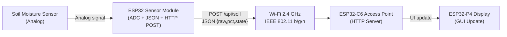

# Smart Plant – Soil Moisture Monitoring System (ESP32 + Wi-Fi)

Smart Plant is an embedded IoT system designed to measure soil moisture in real time and display the data on a dedicated ESP32-based graphical interface.  
The project demonstrates a complete sensor-to-interface wireless communication chain using **Wi-Fi 2.4 GHz (IEEE 802.11)** and a lightweight **HTTP/JSON** protocol.

This project was developed as part of the **Wireless Communication (SEE5)** engineering module.

---

## Repository Structure

```
SmartPlant/
│
├── esp32_sensor/              # Code for ESP32 sensor module (ADC + HTTP POST)
├── esp32_display/             # Code for ESP32-C6 AP + ESP32-P4 display module
├── docs/                      # Full technical specification (SRS)
├── diagrams/                  # Architecture & communication diagrams
├── presentation/              # Final oral presentation slides
└── README.md                  # This file
```

---

## System Overview

Smart Plant is composed of two ESP32 modules working together:

### ESP32 Sensor Module  
- Reads analog soil moisture values  
- Converts raw ADC → percentage  
- Computes soil state (Dry / Normal / Wet)  
- Sends data as **JSON via HTTP POST**  
- Connects to the ESP32-C6 Access Point  

### ESP32-C6 + ESP32-P4 Display Module  
- Creates a local **Wi-Fi Access Point (AP)**  
- Hosts an embedded **HTTP server**  
- Receives sensor data via `/api/soil`  
- Validates JSON and updates the GUI in real time  

The system is **fully local**, requiring no cloud nor internet.

---

## Hardware Used

- **ESP32 Dev Module** (sensor ADC board)  
- **ESP32-C6** (Wi-Fi AP + HTTP server)  
- **ESP32-P4** (graphical interface module)  
- **Soil Moisture Analog Sensor**  
- USB-C for power  

---

## Wireless Communication

- **Wi-Fi 2.4 GHz (IEEE 802.11 b/g/n)**  
- **Access Point created by ESP32-C6**  
- **Channel 6**  
- **Tx Power: 11 dBm** (< 20 dBm ETSI legal limit)  
- Compliant with:
  - ETSI EN 300 328
  - IEEE 802.11
  - EN 62311

---

## System Architecture Diagram (Mermaid)



---

## Installation & Flashing

### ESP32 Sensor Module
1. Open `esp32_sensor/sensor.ino`  
2. Select **ESP32 Dev Module**  
3. Flash to the detected COM port  

### ESP32-C6 + ESP32-P4 Display Module
1. Open `esp32_display/interface.ino`  
2. Select **ESP32-C6 Dev Module**  
3. Upload using USB-C  

---

## Usage

1. Power both modules  
2. The ESP32-C6 acts as a Wi-Fi AP named:  
   ```
   ESP32-GW
   password: 12345678
   ```
3. The sensor module connects automatically  
4. The screen displays updated soil moisture in real time  
5. Optional: Access diagnostics via  
   ```
   http://192.168.4.1/
   ```

---

## API Documentation (Whitelist)

Only **three endpoints** are allowed:

| Endpoint     | Method | Function                      |
|--------------|--------|------------------------------|
| `/`          | GET    | Web info / diagnostics       |
| `/ping`      | GET    | Connectivity test            |
| `/api/soil`  | POST   | Receives JSON soil data      |

All other routes → **404 Not Found**  
Invalid methods → **405 Not Allowed**

### Example JSON payload:
```json
{
  "raw": 1780,
  "pct": 42.5,
  "state": "NORMAL"
}
```

---

## Security Features

- WPA2-protected Wi-Fi AP  
- Whitelist of authorized API routes  
- HTTP method filtering (POST only for `/api/soil`)  
- JSON validation (rejects malformed data)  
- Local-only communication (no internet)  
- RF power limited to 11 dBm → EN 62311 compliant  

---

## Future Enhancements

- Soil moisture history logging  
- Trend analysis  
- Early anomaly detection  
- Predicting watering cycles  
- Automatic pump control  
- MAC filtering for improved API security  

---
